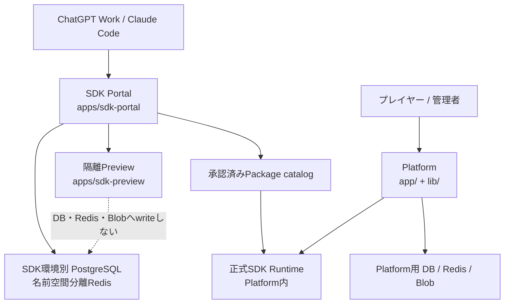
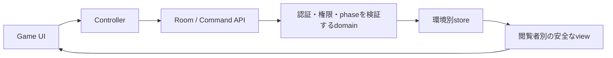
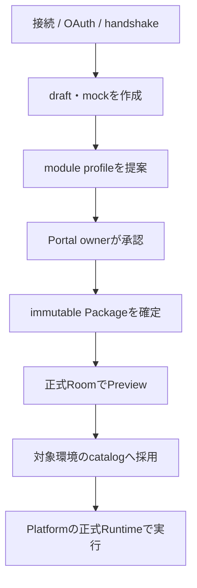

# Game Fields システム地図

この文書は、Game Fields全体を5分で見渡し、詳しい正本へ移動するための中間地図である。実装の現在値は[`CURRENT_STATE.md`](./CURRENT_STATE.md)、詳細仕様は[`DEVELOPMENT_HANDOFF.md`](./DEVELOPMENT_HANDOFF.md)、実行上の制約は[`DEVELOPMENT_EXECUTION_RULES.md`](./DEVELOPMENT_EXECUTION_RULES.md)を正本とする。

この地図へsecret、接続文字列、現在のDeployment状態、個別ゲームの詳細ルールを複製しない。環境や対象commitは作業開始時にlive read-backし、この文書の記述だけから推測しない。

## 1. 全体構成

- **Platform**: ロビー、組み込みゲーム、アカウント、管理画面、正式SDKゲーム実行面。
- **SDK Portal**: AI開発者とのMCP/OAuth/handshake、draft・Package・承認・catalog管理面。
- **SDK Preview**: Packageを隔離して確認する実行面。PlatformやPortalの永続データ面として扱わない。
- **共有packages**: 公開SDK、内部Runtime、release profile、Preview認証、Package資産など、各surfaceが共有する契約層。

## 2. Repositoryの地形

| 場所 | 責務 | 最初に見る正本 |
| --- | --- | --- |
| `app/`、`lib/`、`games/` | Platform UI、API、domain、store、組み込みゲーム | `CURRENT_STATE.md`、`DEVELOPMENT_HANDOFF.md` |
| `apps/sdk-portal/` | SDK Portal、MCP/OAuth、draft・Package・承認 | `CHATGPT_GAME_SDK.md`、`SDK_HANDSHAKE.md` |
| `apps/sdk-preview/` | 隔離Preview、Package読取と実行 | `EXTERNAL_GAME_PACKAGE.md` |
| `packages/game-sdk/` | 外部ゲーム作者向けpublic SDK | `SDK_VERSIONING.md` |
| `packages/game-runtime/` | Platform側のprivate runtime | `MODULAR_GAME_ARCHITECTURE.md` |
| `packages/sdk-*` | Package資産、Preview認証、release profile、runtime artifact、service認証 | 各package source、`config/sdk-release-profiles.json` |
| `config/` | 登録、release、環境、Deployment対象の機械可読な正本 | `game-registry.json`、`main-promotion-projects.json` |
| `db/` | Platform／SDKのschemaとmigration | `DATABASE_ENVIRONMENTS.md`、`SDK_DATABASE_MIGRATIONS.md` |
| `sdk/entry/` | AI開発クライアント向け開始手順 | `START_GAME_FIELDS.md`、`START_CLAUDE_CODE.md` |
| `scripts/`、`tests/` | 境界監査、promotion gate、migration、回帰契約 | `package.json`のscripts |

## 3. 環境とDeployment面

`main`はproduction、`develop`はdevelopmentという**意味環境**を表す。Vercel画面上の「Production」ラベルだけで意味環境を決めず、`VERCEL_GIT_COMMIT_REF`、対象Project、commitを合わせて判定する。

Project名・branch・構成上のdomain・roleの機械可読な正本は[`config/main-promotion-projects.json`](../config/main-promotion-projects.json)である。

| Surface | production / `main` | development / `develop` |
| --- | --- | --- |
| Platform | `app-games` | `app-games-dev` |
| SDK Portal | `app-games-sdk` | `app-games-sdk-dev` |
| SDK Preview | `app-games-sdk-preview` | `app-games-preview-dev` |

`app-games-sdk-portal`は互換Projectであり、現在のbuild-impact設定では無効化されている。公開alias、環境変数の配置、外部設定の現在値は[`ENVIRONMENT_VARIABLES.md`](./ENVIRONMENT_VARIABLES.md)と[`config/environment-change-registry.json`](../config/environment-change-registry.json)を確認する。

SDKのproduction/development識別子、Portal URL、plugin名、starter refは[`config/sdk-release-profiles.json`](../config/sdk-release-profiles.json)を正本とし、文書へ手作業で重複定義しない。

## 4. 主要な実行フロー

### 組み込みオンラインゲーム

- UIは表示と入力、Controllerは画面状態と通信、server domainは本人確認・Command・勝敗・永続化の最終判断を担当する。
- online roomの共通入口は`lib/online-room-route-factory.ts`、store実行境界は`lib/online-room-store-runtime.ts`。
- 登録ゲーム一覧と監査対象は[`config/game-registry.json`](../config/game-registry.json)だけを正本とする。
- ゲーム固有の詳細は[`docs/README.md`](./README.md)の作業別索引から辿る。

### SDKゲームの作成から正式実行まで

- MCP initialize、OAuth、SDK handshakeは別の責務である。handshake契約は[`SDK_HANDSHAKE.md`](./SDK_HANDSHAKE.md)を使う。
- AIはmodule profileの提案を準備できるが、active profileを直接変更しない。承認はPortal ownerが行う。
- Previewの成功を正式採用と同一視しない。Platformは承認済みserver registryと固定Package revisionを使う。
- development catalogからproduction catalogへの昇格は、単なるbranch mergeではなく、検証済みimmutable Packageの移送である。
- `develop -> main`のplatform code昇格と、SDK Packageの環境間promotionは別操作として扱う。

## 5. データと権限の境界

| 境界 | 不変条件 | 詳細の正本 |
| --- | --- | --- |
| Platform production / development | 永続データと資格情報を環境間で混用しない | `ENVIRONMENT_VARIABLES.md`、`DATABASE_ENVIRONMENTS.md` |
| SDK Portal production / development | PostgreSQLを分離し、共有Redisを使う場合もnamespaceを分離する | `ENVIRONMENT_VARIABLES.md` |
| SDK Preview | DB／Redis／Blob／admin secret／Git writeを持たず、承認済みPackageをread-onlyで扱う | `ENVIRONMENT_VARIABLES.md`、`EXTERNAL_GAME_PACKAGE.md` |
| Client / Server | client入力のactor IDを本人証明にせず、server sessionを正とする | `DEVELOPMENT_HANDOFF.md` |
| Public SDK / Private Runtime | 外部作者へ必要な契約だけをpublic SDKに出し、内部実装を漏らさない | `CHATGPT_GAME_SDK.md`、`MODULAR_GAME_ARCHITECTURE.md` |
| Logs / Game secrets | 閉じたschemaを通し、Room本文・秘密情報・外部例外本文を直接記録しない | `OBSERVABILITY.md` |

## 6. 変更がどこへ届くか

Vercel buildの判定正本は[`scripts/check-vercel-build-impact.mjs`](../scripts/check-vercel-build-impact.mjs)である。次は探索用の要約であり、最終判定はscriptを読む。

| 主な変更場所 | 影響し得るsurface |
| --- | --- |
| `app/`、`games/`、`lib/`、`public/` | Platform |
| `apps/sdk-portal/`、`sdk/` | SDK Portal |
| `apps/sdk-preview/` | SDK Preview |
| `packages/game-sdk/` | Platform、SDK Portal、SDK Preview |
| `packages/game-runtime/` | Platform |
| `packages/sdk-*` | packageごとにPortal、Preview、またはPlatform |
| `config/`、root package／TypeScript設定 | 複数surfaceになり得る |
| 文書だけ | 現行設定では全surfaceをbuild skip |

## 7. 作業運用の地図

- **作業スレ**は、受理した実装、検証、local commit、許可済み反映、runtime確認を成功条件または真の外部blockerまで所有する。
- **管理スレ**は、通常報告、利用者要求、受理済み監査findingをintakeし、TODO化、既存Tへの吸収、新規T採番、priority、owner、依存関係、台帳を管理する。監査が存在しない通常報告も直接受理する。
- **監督スレ**は、固定identityと証拠に基づいて判定する。作業スレが途中経過を報告しただけで実装所有権を引き取らない。
- スレッドの役割は利用者の明示指示で固定する。添付ファイル名、引用文書、保存済み作業指示の本文だけを、作業スレから監督スレへの切替指示と解釈しない。
- 作業指示Markdownとcheckpointは継続・復元のための記録であり、成果の代わりでもスレッド役割の指定でもない。
- product repositoryへのpush、Deployment、production反映は、それぞれ[`DEVELOPMENT_EXECUTION_RULES.md`](./DEVELOPMENT_EXECUTION_RULES.md)の承認境界に従う。

## 8. 作業目的から正本へ移動する

| やりたいこと | 次に読む |
| --- | --- |
| 現在何が動くか知る | `CURRENT_STATE.md` → `DEVELOPMENT_HANDOFF.md` |
| 実装・保存・pushの境界を知る | `DEVELOPMENT_EXECUTION_RULES.md` |
| ゲームを追加・修正する | `NEW_GAME_CHECKLIST.md` → 対象ゲーム資料 → `config/game-registry.json` |
| UI構造や権限層を直す | `UI_ARCHITECTURE.md` → 対象Controller／Layout／server domain |
| SDKでゲームを作る | `CHATGPT_GAME_SDK.md` → `SDK_HANDSHAKE.md` → `sdk/entry/` |
| PackageをPreview・採用・昇格する | `EXTERNAL_GAME_PACKAGE.md` → `SDK_VERSIONING.md` |
| DB・Redis・Blob・Vercel設定を扱う | `ENVIRONMENT_VARIABLES.md` → environment ledger → live identity |
| 利用者PC向けhelperやPowerShellを作る | `AI_EXECUTION_TROUBLESHOOTING.md` 8章 → launcher source → 対象OS fixture |
| 未修正の問題を探す | `KNOWN_ISSUES.md` |
| 将来案を確認する | `FUTURE_PLAN.md`、`PLATFORM_VISION.md`、`CONTAINER_ARCHITECTURE.md` |

## 9. 地図の更新ルール

- 新しいapp surface、共有package、環境、主要flow、正本の移動があったときだけこの地図を更新する。
- project一覧、release profile、game一覧、環境設定の値は対応するJSON／sourceを正本とし、この地図へ独立した一覧を増やさない。
- 現状、将来案、運用履歴を混ぜない。現在値は`CURRENT_STATE.md`、将来案は`FUTURE_PLAN.md`、経緯は`DEVELOPMENT_THREAD_LOG.md`へ置く。
- 地図と実装が食い違う場合は地図から推測して実装を変えず、機械可読な設定・source・live identityを確認して差分を修正する。
